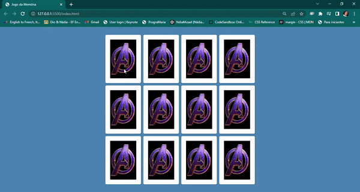

## Jogo da Memória 👩‍💻🧠

 

## Descrição

Projeto realizado para módulo III do Bootcamp TQI FullStack Developer, oferecido pela Digital Innovation One.
Consiste em um jogo da memória desenvolvido utilizando JavaScript, HTML e CSS.

### Para executar o projeto 🕹️

#### **Desenvolvido por <a href="https://www.linkedin.com/in/nadiamizael/">Nádia Mizael</a>.**
